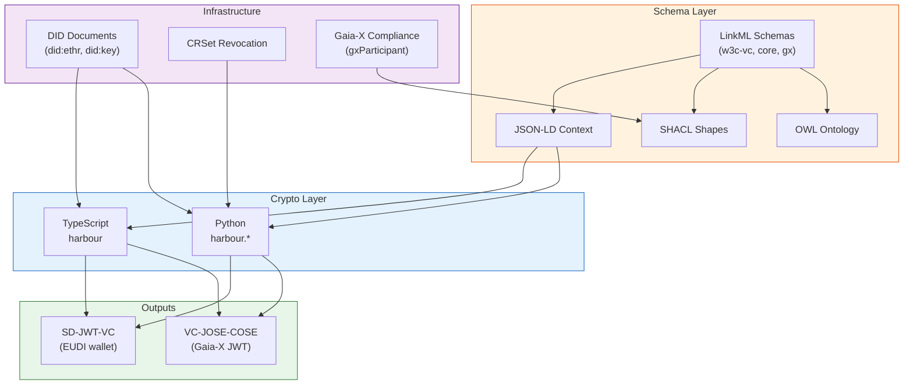
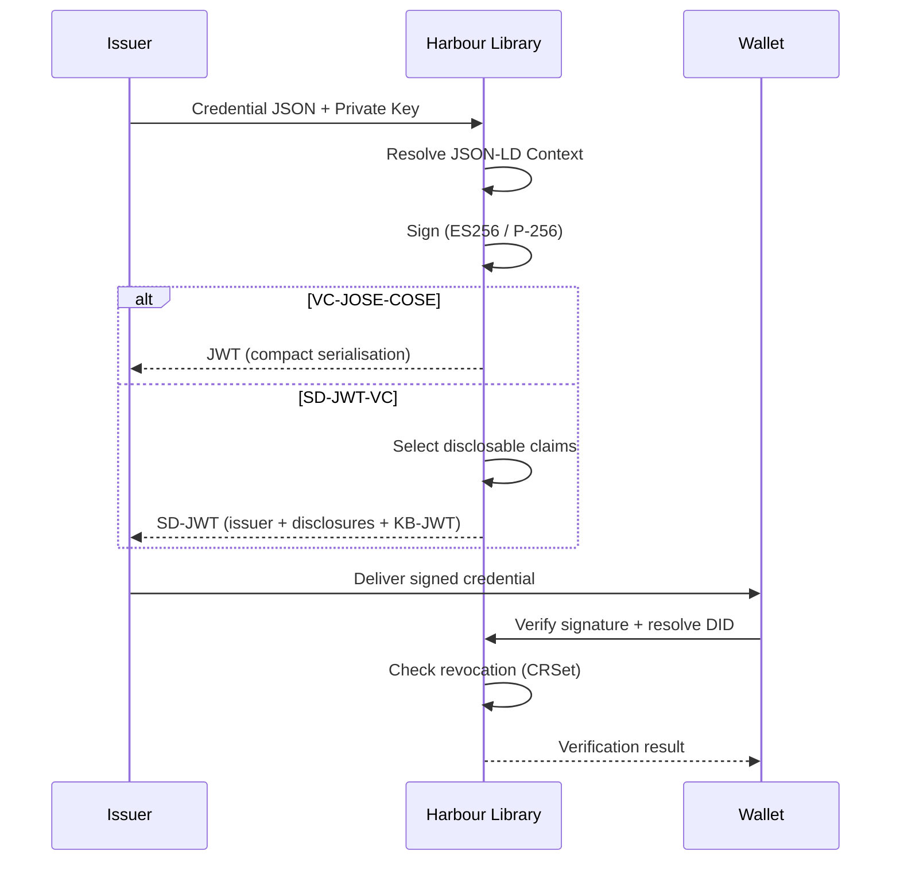

# Architecture Overview

Harbour Credentials is a dual-runtime cryptographic library for signing
and verifying W3C Verifiable Credentials. It spans three layers:

1. **Schema layer** — LinkML definitions that produce OWL, SHACL, and JSON-LD
   context artifacts
2. **Crypto layer** — Python and TypeScript modules for key management,
   signing (VC-JOSE-COSE, SD-JWT-VC), and verification
3. **Infrastructure layer** — DID documents, revocation (CRSet), and
   Gaia-X compliance composition

## Component Diagram



## Data Model

For the full credential type hierarchy, evidence model, Gaia-X composition
pattern, and class map, see [Credential Data Model](schema/credential-model.md).

## Package Structure

```text
harbour-credentials/
├── src/
│   ├── python/
│   │   ├── harbour/           # Crypto library (6 modules)
│   │   └── credentials/       # LinkML pipeline (3 modules)
│   └── typescript/
│       └── harbour/           # Crypto library (6 modules)
├── tests/
│   ├── fixtures/              # Shared fixtures (credentials, keys, tokens)
│   ├── interop/               # Cross-runtime interoperability tests
│   ├── python/                # Python tests (harbour + credentials)
│   └── typescript/harbour/    # TypeScript tests
├── linkml/                    # LinkML schemas
└── artifacts/                 # Generated OWL/SHACL/context (per domain)
```

## Signing Flow



## Architecture Decision Records

| # | Decision | Status |
|---|----------|--------|
| [001](decisions/001-vc-securing-mechanism.md) | SD-JWT-VC (EUDI) + VC-JOSE-COSE (Gaia-X) — dual format | Accepted |
| [002](decisions/002-dual-runtime-architecture.md) | Dual Python/JavaScript runtime | Accepted |
| [003](decisions/003-canonicalization.md) | No canonicalization required | Accepted |
| [004](decisions/004-key-management.md) | ES256 (P-256) primary + X.509 + DID | Accepted |
| [005](decisions/005-did-ethr-migration.md) | did:ethr migration to Base L2 | Accepted |

## Format Relationship

```text
LinkML Schema → JSON-LD Context + SHACL (schema validation)
                       │
          ┌────────────┼────────────┐
          ▼            ▼            ▼
    JSON-LD VCs    VC-JOSE-COSE   SD-JWT-VC
    (examples)     (Gaia-X JWT)  (EUDI wallet)
```

The schema validation layer (SHACL/JSON-LD) validates the attribute design.
The signing layer (JWT/SD-JWT) secures the credential for transport.
Both layers use the same attribute definitions, different serialisations.
