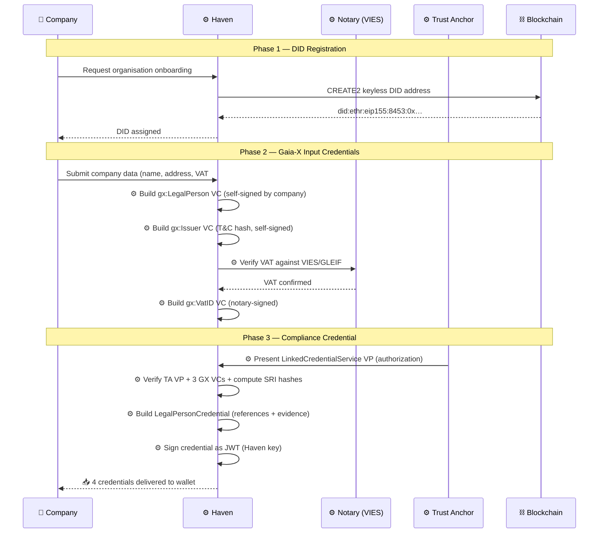
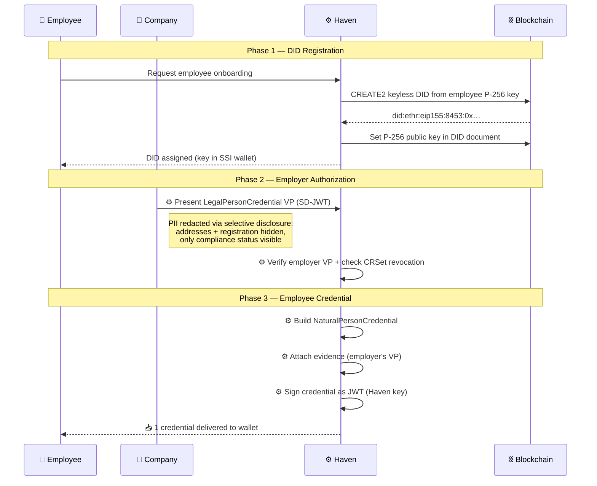
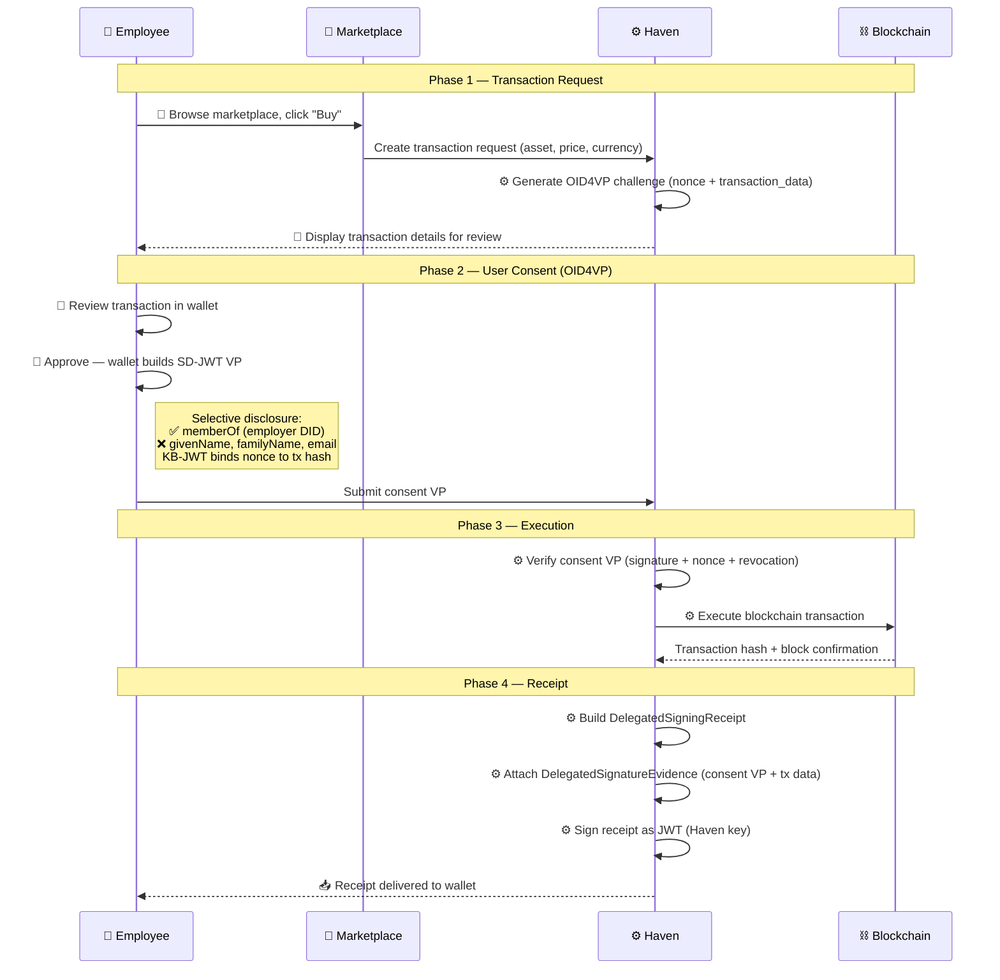
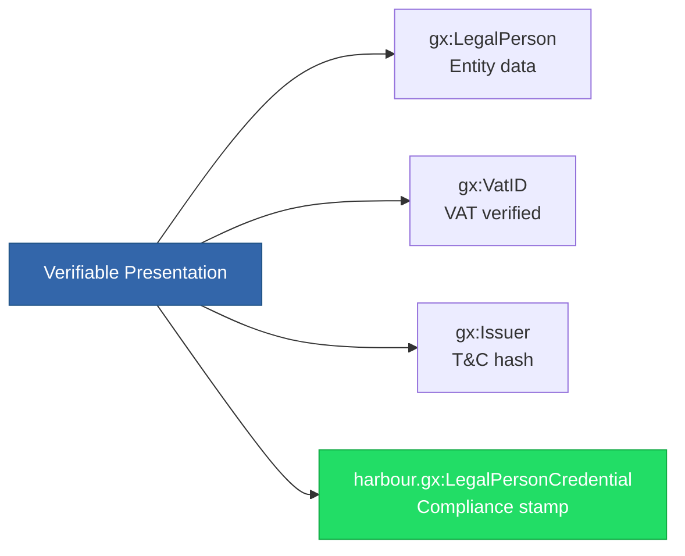

# Credential Lifecycle

This guide traces every credential through the harbour ecosystem — from
issuance to the user's wallet to presentation. The three swimlane
diagrams show **who does what** and which credentials are created at each
step.

!!! tip "Automation note"
    Steps marked with ⚙️ are automated by Haven (the compliance service).
    The user interacts only with steps marked 👤.

---

## Flow A — Company (LegalPerson) Onboarding

A company joins the ecosystem and obtains a Gaia-X–compliant identity.

### Company wallet after onboarding

| # | Credential | Type | Signed by | Purpose |
|---|-----------|------|-----------|---------|
| 1 | `gx:LegalPerson` | Plain Gaia-X | Company (self) | Entity identity data |
| 2 | `gx:VatID` | Plain Gaia-X | Notary | VAT verification |
| 3 | `gx:Issuer` | Plain Gaia-X | Company (self) | T&C acceptance hash |
| 4 | **`harbour.gx:LegalPersonCredential`** | **Harbour compliance** | **Haven** | **Proof of Gaia-X compliance** |

!!! info "What the user actually does"
    The company fills out **one form** (name, address, VAT number, T&C
    checkbox). Haven orchestrates all four credentials automatically.
    The user never sees the individual GX VCs — they arrive as a bundle
    in the wallet.

### What makes credential #4 special

The `LegalPersonCredential` is the **compliance stamp**. Its
`credentialSubject` contains:

| Field | Value | Meaning |
|-------|-------|---------|
| `compliantLegalPersonVC` | SRI hash | Links to gx:LegalPerson VC, verifiable by any party |
| `compliantRegistrationVC` | SRI hash | Links to gx:VatID VC |
| `compliantTermsVC` | SRI hash | Links to gx:Issuer VC |
| `labelLevel` | `SC` | Gaia-X Standard Compliance |
| `rulesVersion` | `CD25.10` | Loire compliance document version |
| `validatedCriteria` | `[PA1.1]` | Specific criteria checked |

The `evidence` field contains the Trust Anchor's VP — proving Haven was
authorized to issue this credential.

---

## Flow B — Employee (NaturalPerson) Onboarding

An employee of a compliant company obtains personal credentials.

### Employee wallet after onboarding

| # | Credential | Type | Signed by | Purpose |
|---|-----------|------|-----------|---------|
| 1 | **`harbour.gx:NaturalPersonCredential`** | **Harbour** | **Haven** | Employee identity + employer link |

!!! info "What the user actually does"
    The employee opens the wallet app and confirms their details (name,
    email). The employer approves in their admin panel. Haven handles
    the VP exchange and issuance automatically.

### Selective disclosure in the evidence

When the company authorizes employee issuance, its
`LegalPersonCredential` is presented as an **SD-JWT** — sensitive
details are hidden:

| Field | Disclosed? | Reason |
|-------|-----------|--------|
| `labelLevel` | ✅ Yes | Proves compliance status |
| `compliantLegalPersonVC` | ✅ Yes | Proves GX VC was verified |
| Company name | ❌ Hidden | Not needed for authorization |
| Company address | ❌ Hidden | PII minimization |
| VAT number | ❌ Hidden | Sensitive business data |

---

## Flow C — Delegated Transaction (Marketplace Purchase)

An employee authorizes a blockchain transaction through the signing
service.

### Employee wallet after transaction

| # | Credential | Added when | Purpose |
|---|-----------|-----------|---------|
| 1 | `NaturalPersonCredential` | Onboarding | Identity |
| 2 | **`DelegatedSigningReceipt`** | **This transaction** | **Proof of purchase** |

!!! info "What the user actually does"
    Click "Buy" → review transaction details in wallet → tap
    "Approve". Three taps total. Haven handles the cryptographic
    consent protocol, blockchain execution, and receipt issuance.

### Three-layer privacy on the receipt

The `DelegatedSigningReceipt` uses selective disclosure to support
different audit levels:

| Layer | Who can see | What's visible |
|-------|-----------|---------------|
| **Public** | Anyone | CRSet entry exists, transaction hash on-chain |
| **Authorized audit** | Regulator / marketplace | Transaction details (asset, price, marketplace DID) |
| **Full compliance** | Court order / internal | Employee identity (name, email, employer) |

---

## Presentation Scenarios

### Company presents to a verifier

The company bundles all four credentials into a single
`VerifiablePresentation`:

A verifier checks:

1. **`LegalPersonCredential`** signed by Haven? → Trusted issuer
2. SRI hashes match the three GX VCs? → Integrity verified
3. `labelLevel` = SC? → Gaia-X compliant
4. CRSet entry not revoked? → Still valid
5. Evidence VP from Trust Anchor? → Authorization chain intact

### Employee presents to a service

The employee selectively discloses only what's needed:

| Scenario | Disclosed fields | Hidden fields |
|----------|-----------------|---------------|
| **Marketplace login** | `memberOf` (employer) | name, email, address |
| **KYC check** | name, email, `memberOf` | address |
| **Full identification** | All fields | (nothing) |

---

## Credential Count Summary

| Role | Onboarding credentials | Per transaction | Wallet total (after 5 txns) |
|------|----------------------|-----------------|---------------------------|
| **Company** | 4 (3 GX + 1 harbour) | 0 | 4 |
| **Employee** | 1 | +1 receipt each | 6 |

!!! note "Scaling consideration"
    Transaction receipts accumulate. A wallet app should archive older
    receipts or support pagination. The receipts themselves are small
    (single JWT) — storage is not a concern, but UX presentation is.

---

## Automation Summary

| Step | Manual (👤) | Automated (⚙️) | Why automated? |
|------|-----------|---------------|---------------|
| Company data entry | 👤 Form | — | Only the company knows its data |
| VAT verification | — | ⚙️ VIES API | Deterministic lookup, no human judgment |
| GX VC creation | — | ⚙️ Haven builds 3 VCs | Standard format, no decisions needed |
| Trust Anchor auth | — | ⚙️ TA presents VP | Pre-configured trust relationship |
| Compliance credential | — | ⚙️ Haven issues | Rule-based: 3 VCs present + valid → issue |
| Employee data entry | 👤 Confirm details | — | Only the employee knows their data |
| Employer approval | 👤 Admin panel | — | Business decision |
| Employee credential | — | ⚙️ Haven issues | Employer VP valid → issue |
| Transaction review | 👤 Approve in wallet | — | Must be explicit user consent |
| Blockchain execution | — | ⚙️ Haven executes | Technical step, consent already given |
| Receipt issuance | — | ⚙️ Haven issues | Automatic after successful execution |

**Bottom line:** The user makes **3 decisions** (enter data, approve
employee, approve transaction). Everything else is automated.
