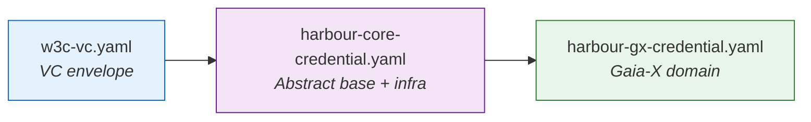
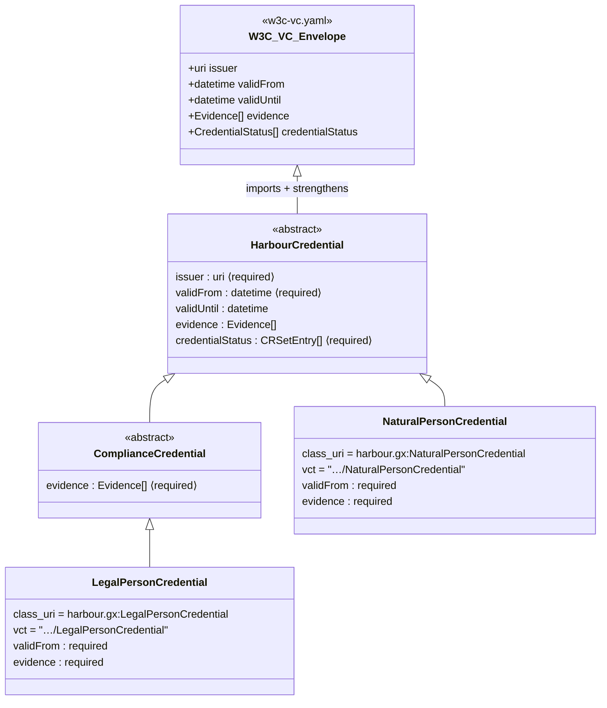
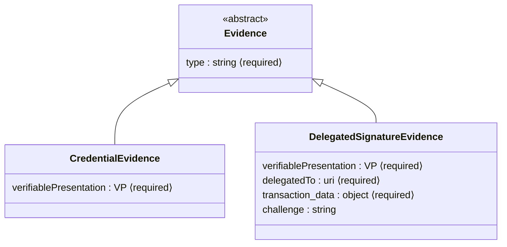
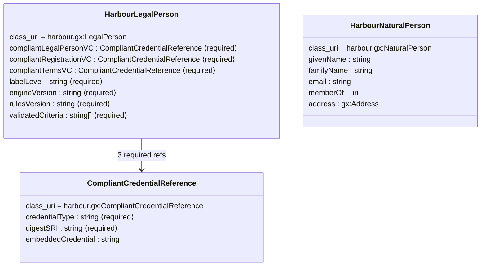
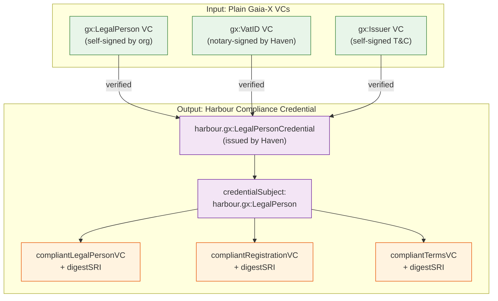
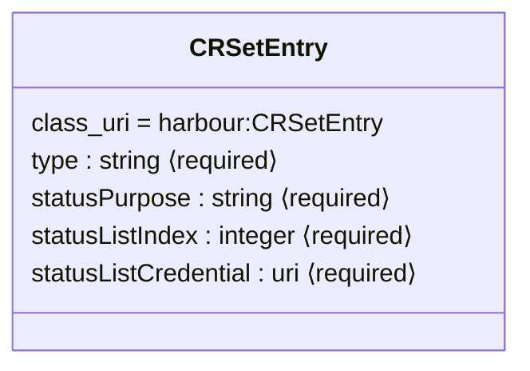
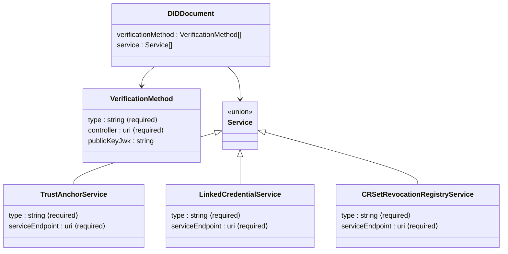
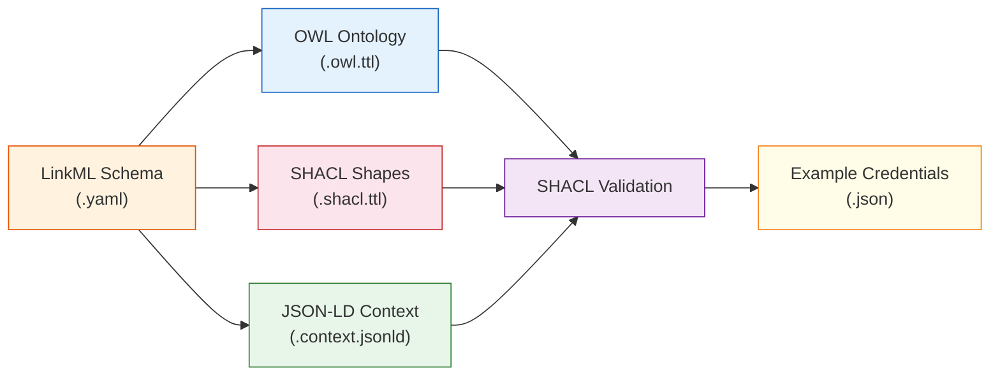

# Credential Data Model

This page documents the LinkML schema inheritance hierarchy, composition
patterns, and trust chain architecture used by Harbour Credentials.

## Schema File Structure

```text
linkml/
├── w3c-vc.yaml                   # W3C VC Data Model v2.0 envelope
├── harbour-core-credential.yaml  # Abstract base, evidence, revocation, DID
└── harbour-gx-credential.yaml    # Gaia-X domain layer (participants)
```

Each file builds on the previous one through LinkML `imports`.

## Import Chain



Downstream consumers (e.g. SimpulseID) import `harbour-core-credential`
via an import map and define their own credential types on top.

---

## Credential Type Hierarchy

All credential types inherit from `HarbourCredential`, which strengthens
the optional W3C VC v2.0 envelope fields into a harbour-specific profile.



### What `HarbourCredential` Strengthens

The W3C VC Data Model v2.0 defines most envelope fields as optional.
`HarbourCredential` tightens these for the harbour profile:

| Field | W3C VC v2.0 | HarbourCredential | ComplianceCredential / NPC |
|-------|-------------|-------------------|---------------------------|
| `issuer` | optional | **required** | **required** |
| `validFrom` | optional | **required** | **required** |
| `validUntil` | optional | optional | optional |
| `evidence` | optional | optional | **required** |
| `credentialStatus` | optional | **required** (range: `CRSetEntry`) | **required** |

!!! note "Evidence requirement"
    Evidence is optional at the base `HarbourCredential` level (e.g. the
    Trust Anchor's self-signed `LinkedCredentialService` credential has no
    evidence — it is the root of trust). Domain-specific types
    (`ComplianceCredential`, `NaturalPersonCredential`) make evidence
    **required** via `slot_usage` overrides.

!!! note "Downstream overrides"
    Consumers like SimpulseID may loosen these constraints via `slot_usage`.
    For example, SimpulseID makes `evidence` and `credentialStatus` optional
    for its credential types.

---

## Evidence Hierarchy

Evidence documents how a credential's claims were verified. Harbour defines
an abstract base with two concrete types:



**`CredentialEvidence`** — attests that an authorizing party approved the
credential issuance via OID4VP. The embedded VP contains the authorizer's
credential (Trust Anchor's LinkedCredentialService for org issuance, or
org's LegalPersonCredential for employee issuance).

**`DelegatedSignatureEvidence`** — attests that the subject authorized a
signing service to act on their behalf via an OID4VP challenge-response
flow. See [Delegated Signing](../guide/delegated-signing.md).

---

## Credential Subject Types

Subject types define what a credential asserts about a person or
organisation. These are **not** inherited from `HarbourCredential` — they
are standalone classes used as the `credentialSubject` value.

### harbour.gx:LegalPerson — Compliance Attestation

`harbour.gx:LegalPerson` is a **pure compliance type** — it does NOT contain
entity data (name, addresses, registrationNumber). Entity data lives in the
referenced plain `gx:LegalPerson` input VC. This type only carries compliance
enforcement slots with SHACL `sh:minCount 1`:



### Credential ↔ Subject Pairing

| Credential Type | Subject Type | Use Case |
|----------------|-------------|----------|
| `harbour.gx:LegalPersonCredential` | `harbour.gx:LegalPerson` | Organisation compliance attestation |
| `harbour.gx:NaturalPersonCredential` | `harbour.gx:NaturalPerson` | Individual identity |

---

## Gaia-X Compliance Model

Gaia-X requires three mandatory VCs for participant compliance
([GX Architecture Document 25.11](https://docs.gaia-x.eu/technical-committee/architecture-document/25.11/)):

1. **gx:LegalPerson** — self-signed entity identity (name, addresses, registration)
2. **gx:VatID** — notary-verified registration number
3. **gx:Issuer** — self-signed Terms & Conditions acceptance

Harbour's `LegalPersonCredential` IS the compliance credential — holding
a valid one means Haven has verified all three underlying Gaia-X VCs.

### How It Works

The input VCs are **plain Gaia-X** (type: `VerifiableCredential` only, no
harbour envelope). Haven verifies them and issues a `LegalPersonCredential`
whose `credentialSubject` (type: `harbour.gx:LegalPerson`) contains:

- Three `CompliantCredentialReference` slots with `digestSRI` integrity hashes
- Compliance metadata (`labelLevel`, `engineVersion`, `rulesVersion`, `validatedCriteria`)



### Two Delivery Patterns

**Referenced pattern** — input VCs are referenced by `digestSRI` hash only.
The full VCs are delivered separately (e.g. in a Verifiable Presentation
or via a credential registry).

**Embedded pattern** — input VCs are JSON-stringified inside
`embeddedCredential` for self-contained verification. The `digestSRI`
still serves as integrity proof.

Harbour generates its SHACL with `exclude_imports=True` to avoid
duplicating gx shapes. Gaia-X shapes are validated separately via the
ontology-management-base pipeline.

---

## Revocation Infrastructure

Harbour uses a **Credential Revocation Set (CRSet)** mechanism for
status management:



Each credential carries a `credentialStatus` array of `CRSetEntry`
objects pointing to an on-chain or hosted status list.

---

## DID Document Model

Harbour defines a DID Document structure for key resolution and service
discovery:



---

## Artifact Generation Pipeline

LinkML schemas produce three types of artifacts:



| Artifact | Purpose | Generated By |
|----------|---------|-------------|
| **OWL** (`.owl.ttl`) | Class hierarchy and property definitions | `gen-owl` |
| **SHACL** (`.shacl.ttl`) | Validation constraints (required, ranges, cardinality) | `HarbourShaclGenerator` |
| **JSON-LD Context** (`.context.jsonld`) | Term-to-IRI mappings for JSON-LD serialisation | `DomainContextGenerator` |

Run `make generate` to regenerate all artifacts from schemas.

---

## Complete Class Map

For quick reference, every class defined across all three schema files:

| Class | Schema File | Abstract | Parent | Domain |
|-------|-------------|----------|--------|--------|
| `HarbourCredential` | core | ✅ | *(W3C VC envelope)* | Core |
| `Evidence` | core | ✅ | — | Core |
| `CredentialEvidence` | core | — | `Evidence` | Core |
| `DelegatedSignatureEvidence` | core | — | `Evidence` | Core |
| `CRSetEntry` | core | — | — | Core |
| `DIDDocument` | core | — | — | Core |
| `VerificationMethod` | core | — | — | Core |
| `TrustAnchorService` | core | — | *(Service union)* | Core |
| `LinkedCredentialService` | core | — | *(Service union)* | Core |
| `CRSetRevocationRegistryService` | core | — | *(Service union)* | Core |
| `ComplianceCredential` | gx | ✅ | `HarbourCredential` | Gaia-X |
| `LegalPersonCredential` | gx | — | `ComplianceCredential` | Gaia-X |
| `NaturalPersonCredential` | gx | — | `HarbourCredential` | Gaia-X |
| `HarbourLegalPerson` | gx | — | — | Gaia-X |
| `CompliantCredentialReference` | gx | — | — | Gaia-X |
| `HarbourNaturalPerson` | gx | — | `gx:Participant` | Gaia-X |
