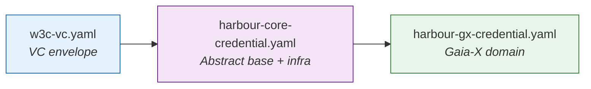
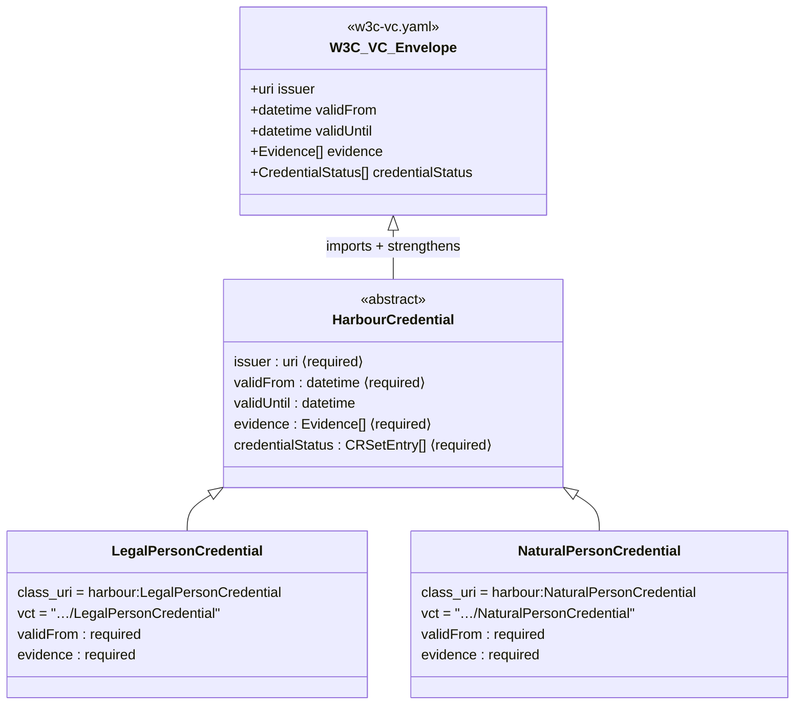
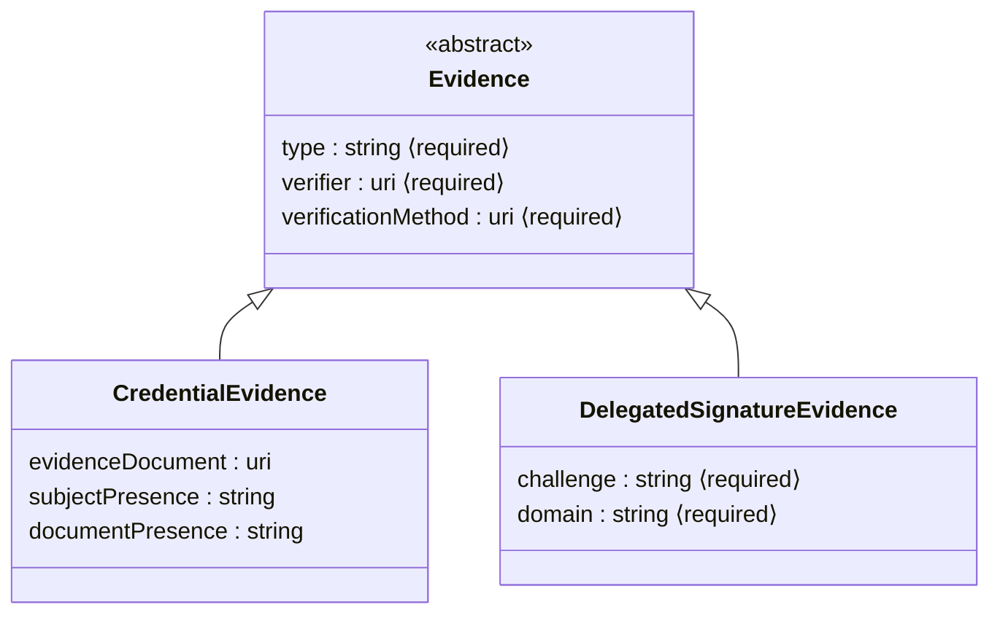
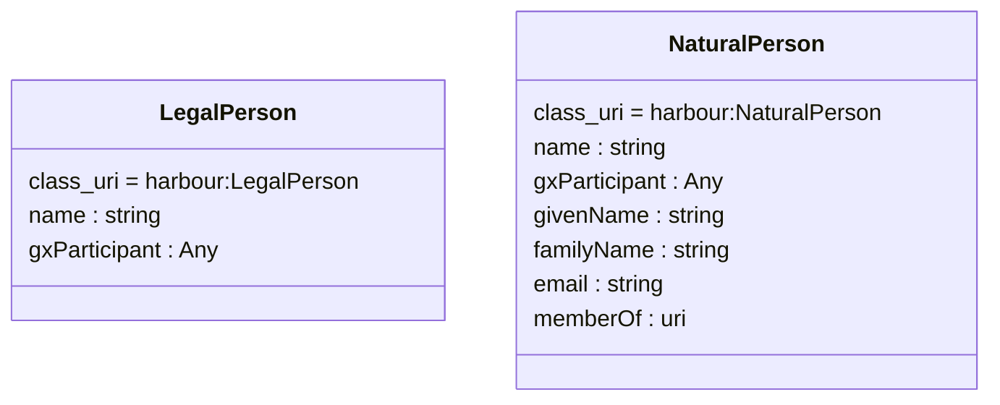
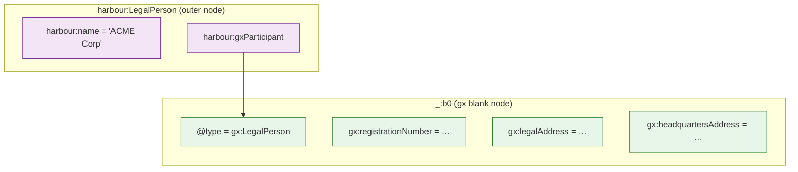
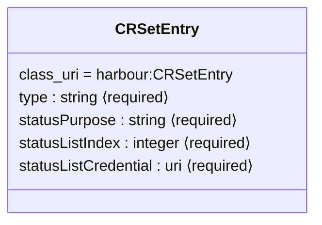
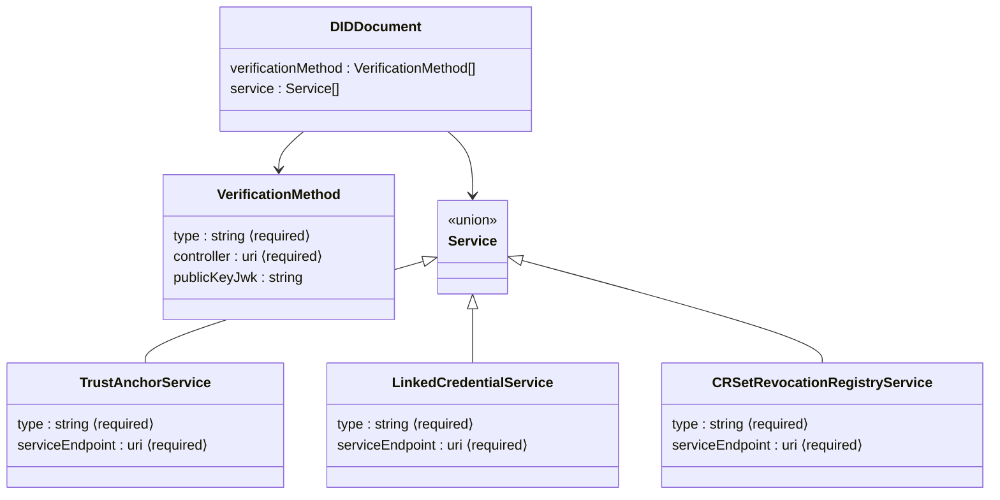
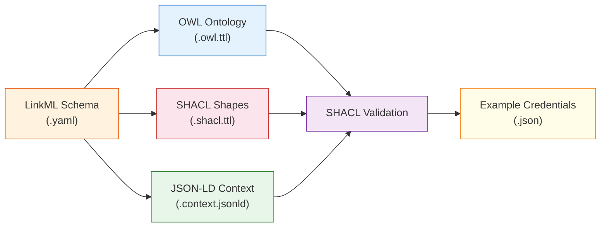

# Credential Data Model

This page documents the LinkML schema inheritance hierarchy, composition
patterns, and trust chain architecture used by Harbour Credentials.

## Schema File Structure

```text
linkml/
├── w3c-vc.yaml                   # W3C VC Data Model v2.0 envelope
├── harbour-core-credential.yaml  # Abstract base, evidence, revocation, DID
└── harbour-gx-credential.yaml    # Gaia-X domain layer (participants)
```

Each file builds on the previous one through LinkML `imports`.

## Import Chain



Downstream consumers (e.g. SimpulseID) import `harbour-core-credential`
via an import map and define their own credential types on top.

---

## Credential Type Hierarchy

All credential types inherit from `HarbourCredential`, which strengthens
the optional W3C VC v2.0 envelope fields into a harbour-specific profile.



### What `HarbourCredential` Strengthens

The W3C VC Data Model v2.0 defines most envelope fields as optional.
`HarbourCredential` tightens these for the harbour profile:

| Field | W3C VC v2.0 | HarbourCredential |
|-------|-------------|-------------------|
| `issuer` | optional | **required** |
| `validFrom` | optional | **required** |
| `validUntil` | optional | optional |
| `evidence` | optional | **required** |
| `credentialStatus` | optional | **required** (range: `CRSetEntry`) |

!!! note "Downstream overrides"
    Consumers like SimpulseID may loosen these constraints via `slot_usage`.
    For example, SimpulseID makes `evidence` and `credentialStatus` optional
    for its credential types.

---

## Evidence Hierarchy

Evidence documents how a credential's claims were verified. Harbour defines
an abstract base with two concrete types:



**`CredentialEvidence`** — attests that a human verifier checked documents
(identity papers, registration certificates) before issuance.

**`DelegatedSignatureEvidence`** — attests that the subject authorized a
signing service to act on their behalf via an OID4VP challenge-response
flow. See [Delegated Signing](../guide/delegated-signing.md).

---

## Credential Subject Types

Subject types define what a credential asserts about a person or
organisation. These are **not** inherited from `HarbourCredential` — they
are standalone classes used as the `credentialSubject` value.



### Credential ↔ Subject Pairing

| Credential Type | Subject Type | Use Case |
|----------------|-------------|----------|
| `LegalPersonCredential` | `LegalPerson` | Organisation identity |
| `NaturalPersonCredential` | `NaturalPerson` | Individual identity |

---

## Gaia-X Composition Pattern

Gaia-X Trust Framework defines **closed SHACL shapes** (`sh:closed true`)
on `gx:LegalPerson` and `gx:Participant`. Adding any non-gx property to
a `gx:` node violates the closed shape constraint.

Harbour solves this with **composition** — the outer harbour node owns
harbour-specific properties, and a nested blank node carries only
gx-valid properties:



### Why Not Extend gx:LegalPerson Directly?

Adding harbour properties to a `gx:` node violates `sh:closed`:

```turtle
# ❌ Wrong — SHACL violation
harbour:MyOrg a gx:LegalPerson ;
    gx:registrationNumber … ;
    harbour:extraField "value" .
```

Composition keeps gx shapes intact:

```turtle
# ✅ Correct — separate nodes
harbour:MyOrg a harbour:LegalPerson ;
    harbour:name "ACME" ;
    harbour:gxParticipant [
        a gx:LegalPerson ;
        gx:registrationNumber …
    ] .
```

The `gxParticipant` slot has `range: Any` because the nested content is
validated by Gaia-X's own SHACL shapes (`gx.shacl.ttl`), not harbour's.
Harbour generates its SHACL with `exclude_imports=True` to keep shape
sets separate.

---

## Revocation Infrastructure

Harbour uses a **Credential Revocation Set (CRSet)** mechanism for
status management:



Each credential carries a `credentialStatus` array of `CRSetEntry`
objects pointing to an on-chain or hosted status list.

---

## DID Document Model

Harbour defines a DID Document structure for key resolution and service
discovery:



---

## Artifact Generation Pipeline

LinkML schemas produce three types of artifacts:



| Artifact | Purpose | Generated By |
|----------|---------|-------------|
| **OWL** (`.owl.ttl`) | Class hierarchy and property definitions | `gen-owl` |
| **SHACL** (`.shacl.ttl`) | Validation constraints (required, ranges, cardinality) | `HarbourShaclGenerator` |
| **JSON-LD Context** (`.context.jsonld`) | Term-to-IRI mappings for JSON-LD serialisation | `DomainContextGenerator` |

Run `make generate` to regenerate all artifacts from schemas.

---

## Complete Class Map

For quick reference, every class defined across all three schema files:

| Class | Schema File | Abstract | Parent | Domain |
|-------|-------------|----------|--------|--------|
| `HarbourCredential` | core | ✅ | *(W3C VC envelope)* | Core |
| `Evidence` | core | ✅ | — | Core |
| `CredentialEvidence` | core | — | `Evidence` | Core |
| `DelegatedSignatureEvidence` | core | — | `Evidence` | Core |
| `CRSetEntry` | core | — | — | Core |
| `DIDDocument` | core | — | — | Core |
| `VerificationMethod` | core | — | — | Core |
| `TrustAnchorService` | core | — | *(Service union)* | Core |
| `LinkedCredentialService` | core | — | *(Service union)* | Core |
| `CRSetRevocationRegistryService` | core | — | *(Service union)* | Core |
| `LegalPersonCredential` | gx | — | `HarbourCredential` | Gaia-X |
| `NaturalPersonCredential` | gx | — | `HarbourCredential` | Gaia-X |
| `LegalPerson` | gx | — | — | Gaia-X |
| `NaturalPerson` | gx | — | — | Gaia-X |
