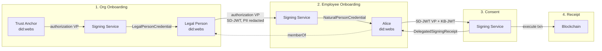
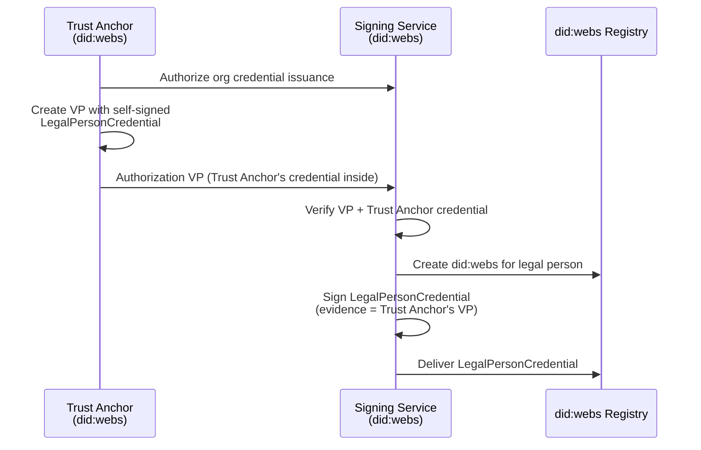
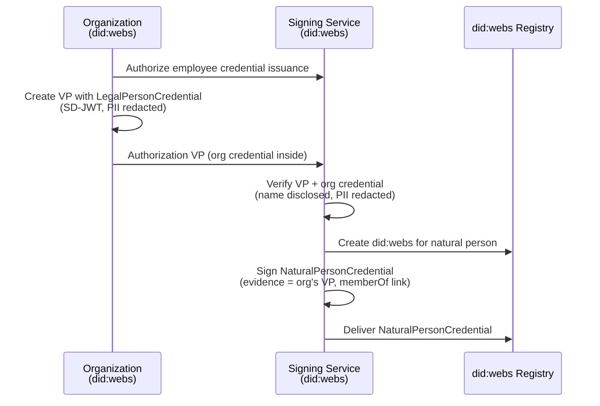
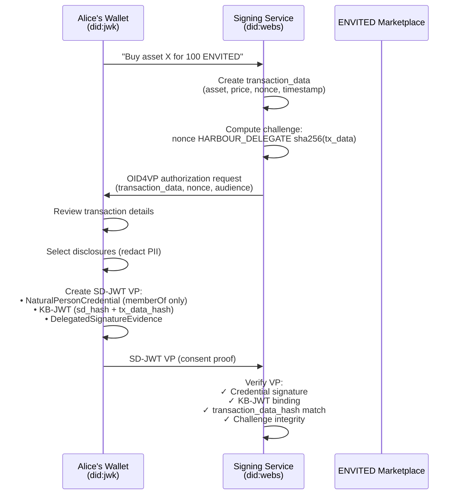
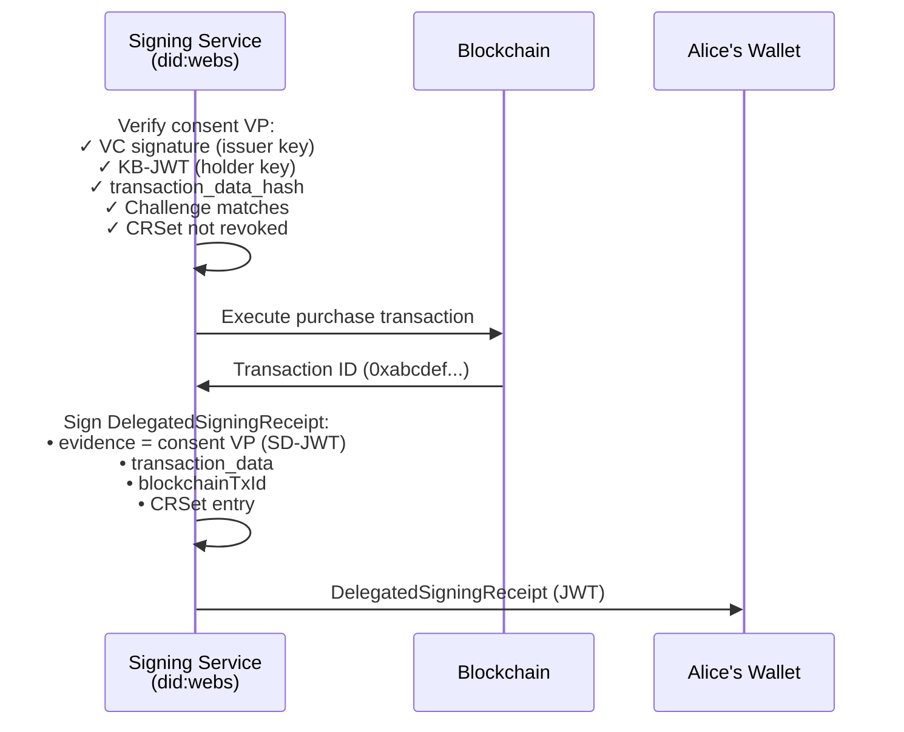

# Harbour Credentials — Example User Journey

This folder contains a complete, end-to-end example of the Harbour credential
lifecycle: from organization onboarding through employee credentialing to a
delegated blockchain transaction with privacy-preserving audit.

## Overview



## Skeleton Credentials vs Domain Extensions

The examples in this directory are **harbour skeletons** — they define the
minimum base structure required for each credential type, without any
domain-specific compliance data. The `delegated-signing-receipt.json` is the
canonical reference for the skeleton pattern.

Domain extensions live in subdirectories and add compliance data on top of the
skeleton. Currently:

- **`gaiax/`** — [Gaia-X domain extensions](gaiax/README.md): adds
  `gxParticipant` inner nodes with Gaia-X properties (registration number,
  addresses) and the `https://w3id.org/gaia-x/development#` context.

The `gxParticipant` composition slot is defined as `required: false` in the
harbour schema — it is only populated when a domain extension needs it.

## Credential Issuance Model

The Harbour Signing Service is the **sole issuer** of all credentials, acting
"on behalf of" an authorizing party. The `evidence` field on each credential
contains a VP proving who authorized the issuance:

- **LegalPersonCredential**: Trust Anchor authorizes the org by presenting a VP
  containing its self-signed LegalPersonCredential. The Signing Service issues
  the credential with this VP as evidence.
- **NaturalPersonCredential**: Org authorizes the employee by presenting a VP
  containing its own LegalPersonCredential (SD-JWT, sensitive fields redacted).
  The Signing Service issues the credential with this VP as evidence.

### Trust Anchor Self-Signed Credential

The Trust Anchor holds a **self-signed LegalPersonCredential** (analogous to a
root CA certificate) where `issuer == credentialSubject.id`. This credential is
publicly resolvable via a `LinkedCredentialService` endpoint in the Trust
Anchor's DID document. See [`trust-anchor-credential.json`](trust-anchor-credential.json).

## Actors and Identities

Every actor has a `did:webs` identity (KERI-backed, long-lived). Users also have
a `did:jwk` wallet key (P-256) in the Altme wallet. When a user requests a
credential, the authorizing party presents a VP to the Signing Service. Harbour
then creates the `did:webs` identifier and embeds **the same P-256 public key**
from the wallet into the new `did:webs` DID document.

| Actor | Role | Identity (`did:webs`) | DID Document |
|-------|------|-----------------------|--------------|
| **Harbour Trust Anchor** | Root of trust, authorizes orgs | `did:webs:reachhaven.com:ENVSnGVU_q39C0Lsim8CtXP_c0TbQW7BBndLVnBeDPXo` | [`harbour-trust-anchor.did.json`](did-webs/harbour-trust-anchor.did.json) |
| **Harbour Signing Service** | Issues ALL credentials (`#key-1`), signs delegated txns (`#key-2`) | `did:webs:harbour.reachhaven.com:Er9_mnFstIFyj7JXhHtf7BTHAaUXkaFoJQq96z8WycDQ` | [`harbour-signing-service.did.json`](did-webs/harbour-signing-service.did.json) |
| **Example Corporation GmbH** | Legal person (organization) | `did:webs:participants.harbour.reachhaven.com:legal-persons:0aa6d7ea-...:ENro7uf0eP...` | [`legal-person-0aa6d7ea-...did.json`](did-webs/legal-person-0aa6d7ea-27ef-416f-abf8-9cb634884e66.did.json) |
| **Alice Smith** | Natural person (employee) | `did:webs:users.altme.example:natural-persons:550e8400-...:EKYGGh-Ft...` | [`natural-person-550e8400-...did.json`](did-webs/natural-person-550e8400-e29b-41d4-a716-446655440000.did.json) |
| **ENVITED Marketplace** | Data marketplace (external) | `did:web:dataspace.envited.io` | — |

> **Privacy note**: All `did:webs` identifiers use UUID path segments — never
> real names or organization names. This prevents DID IRIs from leaking identity
> information at the public layer.

### Signing Service Key Roles

The Signing Service DID document contains two verification methods:

| Key | Relationship | Purpose |
|-----|-------------|---------|
| `#key-1` | `assertionMethod` | Credential issuance (signs all VCs) |
| `#key-2` | `capabilityDelegation` | Delegated transaction signing |

Both keys are listed under `authentication`.

---

## Step 1: Organization Onboarding — LegalPersonCredential

The Trust Anchor authorizes the Signing Service to issue a `LegalPersonCredential`
for an organization. The Trust Anchor presents a VP containing its **self-signed
LegalPersonCredential** to the Signing Service, which then issues the credential
with this VP as evidence.



**What the evidence proves**: The Trust Anchor (root of trust) authorized the
Signing Service to issue this credential. The VP contains the Trust Anchor's
self-signed LegalPersonCredential, establishing the chain of trust.

### Example files

| File | Description |
|------|-------------|
| [`trust-anchor-credential.json`](trust-anchor-credential.json) | Trust Anchor's self-signed credential (root of trust) |
| [`legal-person-credential.json`](legal-person-credential.json) | Unsigned credential (expanded JSON-LD) |
| [`signed/legal-person-credential.jwt`](signed/legal-person-credential.jwt) | Signed credential (VC-JOSE-COSE wire format) |
| [`signed/legal-person-credential.decoded.json`](signed/legal-person-credential.decoded.json) | Decoded JWT (header + payload) |
| [`signed/legal-person-credential.evidence-vp.jwt`](signed/legal-person-credential.evidence-vp.jwt) | Evidence VP (Trust Anchor authorization) |
| [`did-webs/legal-person-0aa6d7ea-...did.json`](did-webs/legal-person-0aa6d7ea-27ef-416f-abf8-9cb634884e66.did.json) | Legal person DID document |

### Code

```python
# Python — sign the credential
from harbour.signer import sign_vc_jose
signed_jwt = sign_vc_jose(credential, private_key, kid=issuer_kid)
```

```typescript
// TypeScript — sign the credential
import { signJwt } from '@reachhaven/harbour-credentials';
const signedJwt = await signJwt(credential, privateKey, { kid: issuerKid });
```

---

## Step 2: Employee Onboarding — NaturalPersonCredential

The organization authorizes the Signing Service to issue a `NaturalPersonCredential`
for an employee. The org presents a VP containing its **LegalPersonCredential**
(SD-JWT with sensitive fields redacted — registration number and addresses hidden,
name/legalName disclosed). The Signing Service issues the credential with this VP
as evidence.



**Chain of trust**: The Trust Anchor authorized the org (Step 1), the org
authorizes the employee (Step 2), and the Signing Service issues both credentials.
The `memberOf` field references the legal person's opaque `did:webs` identifier
(UUID-based, no company name). A verifier can resolve this DID to confirm
organizational affiliation without the credential itself leaking PII.

> **Discussion point**: `memberOf` is currently selectively disclosable. Whether
> it should be always-disclosed (to guarantee the trust chain) or remain
> optional (for maximum privacy) is an open design decision.

### Example files

| File | Description |
|------|-------------|
| [`natural-person-credential.json`](natural-person-credential.json) | Unsigned credential (expanded JSON-LD) |
| [`signed/natural-person-credential.jwt`](signed/natural-person-credential.jwt) | Signed credential (VC-JOSE-COSE wire format) |
| [`signed/natural-person-credential.decoded.json`](signed/natural-person-credential.decoded.json) | Decoded JWT (header + payload) |
| [`signed/natural-person-credential.evidence-vp.jwt`](signed/natural-person-credential.evidence-vp.jwt) | Evidence VP (org authorization) |
| [`did-webs/natural-person-550e8400-...did.json`](did-webs/natural-person-550e8400-e29b-41d4-a716-446655440000.did.json) | Alice's DID document |

### Code

```python
# Python — convert to SD-JWT-VC flat claims
from credentials.claim_mapping import vc_to_sd_jwt_claims, MAPPINGS
mapping = MAPPINGS["harbour:NaturalPersonCredential"]
claims, disclosable = vc_to_sd_jwt_claims(credential, mapping)
# claims: {"iss": ..., "vct": ..., "givenName": "Alice", "memberOf": "did:webs:..."}
# disclosable: ["givenName", "familyName", "email", "memberOf"]
```

---

## Step 3: Delegated Transaction — Consent VP

Alice wants to buy a data asset on the ENVITED marketplace. Instead of signing the
blockchain transaction directly, she delegates it to the Harbour Signing Service.

The signing service creates an OID4VP `transaction_data` object describing the
purchase. Alice's wallet creates an **SD-JWT VP** with:

- Her `NaturalPersonCredential` (PII redacted — only `memberOf` disclosed)
- A **KB-JWT** binding her signature to the `transaction_data` hash
- `DelegatedSignatureEvidence` with the challenge string



**What Alice discloses** (selective disclosure):

| Claim | Disclosed? | Why |
|-------|-----------|-----|
| `memberOf` | Yes | Trust chain — proves organizational affiliation |
| `name` | Yes | Non-PII display name |
| `givenName` | No | PII — redacted |
| `familyName` | No | PII — redacted |
| `email` | No | PII — redacted |

### Wire format

On the wire, the consent VP is an SD-JWT compact serialization:
`<vp-jwt>~<disclosure1>~...~<kb-jwt>`

The consent VP is not persisted as a standalone example — it is an ephemeral
artifact between Alice's wallet and the Signing Service. The receipt credential
([`delegated-signing-receipt.json`](delegated-signing-receipt.json)) embeds the
consent VP as evidence, making it the durable audit record.

### Code

```python
# Python — create delegation challenge
from harbour.delegation import TransactionData, create_delegation_challenge

tx = TransactionData.create(
    action="data.purchase",
    txn={
        "asset_id": "urn:uuid:550e8400-e29b-41d4-a716-446655440000",
        "price": "100",
        "currency": "ENVITED",
        "marketplace": "did:web:dataspace.envited.io",
    },
    credential_ids=["harbour_natural_person"],
)
challenge = create_delegation_challenge(tx)
# "da9b1009 HARBOUR_DELEGATE cb991694..."
```

```python
# Python — create consent VP with selective disclosure
from harbour.sd_jwt_vp import issue_sd_jwt_vp

sd_jwt_vp = issue_sd_jwt_vp(
    alice_sd_jwt_vc,
    alice_private_key,
    disclosures=["memberOf"],       # only disclose non-PII
    evidence=[{
        "type": "DelegatedSignatureEvidence",
        "transaction_data": tx.to_dict(),
        "delegatedTo": "did:webs:harbour.reachhaven.com:Er9_mnFstIFyj7JXhHtf7BTHAaUXkaFoJQq96z8WycDQ",
    }],
    nonce=tx.nonce,
    audience="did:webs:harbour.reachhaven.com:Er9_mnFstIFyj7JXhHtf7BTHAaUXkaFoJQq96z8WycDQ",
)
```

```typescript
// TypeScript equivalents
import {
  createTransactionData, createDelegationChallenge,
  issueSdJwtVp,
} from '@reachhaven/harbour-credentials';
```

---

## Step 4: Transaction Execution — DelegatedSigningReceipt

The signing service verifies Alice's consent VP, executes the blockchain purchase,
and issues a **receipt credential** (`DelegatedSigningReceipt`) with the consent
proof embedded as evidence.



### Three-Layer Privacy Model

The receipt credential is an **SD-JWT-VC**. Different audiences see different
layers of information:

| Layer | Audience | What's Visible |
|-------|----------|----------------|
| **Layer 1 — Public** | Everyone | CRSet entry (credential exists), `transactionHash` on-chain, DID identifiers (opaque UUIDs), KB-JWT signature valid |
| **Layer 2 — Authorized** | Auditor | Transaction details (asset, price, marketplace), consent VP hash verification, `memberOf` (organization DID) |
| **Layer 3 — Full Audit** | Compliance | User identity (name, email, organization name), full credential chain |

### Example files

| File | Description |
|------|-------------|
| [`delegated-signing-receipt.json`](delegated-signing-receipt.json) | Unsigned receipt (expanded JSON-LD) |
| [`signed/delegated-signing-receipt.jwt`](signed/delegated-signing-receipt.jwt) | Signed receipt (VC-JOSE-COSE wire format) |
| [`signed/delegated-signing-receipt.decoded.json`](signed/delegated-signing-receipt.decoded.json) | Decoded JWT (header + payload) |
| [`signed/delegated-signing-receipt.evidence-vp.jwt`](signed/delegated-signing-receipt.evidence-vp.jwt) | Evidence VP (consent proof, signed) |

### Code

```python
# Python — verify consent VP
from harbour.sd_jwt_vp import verify_sd_jwt_vp

result = verify_sd_jwt_vp(
    sd_jwt_vp,
    issuer_public_key,
    holder_public_key,
    expected_nonce="da9b1009",
    expected_audience="did:webs:harbour.reachhaven.com:Er9_mnFstIFyj7JXhHtf7BTHAaUXkaFoJQq96z8WycDQ",
)

# Python — sign receipt credential
from harbour.signer import sign_vc_jose
receipt_jwt = sign_vc_jose(receipt, service_private_key, kid=service_kid)
```

```typescript
// TypeScript equivalents
import { verifySdJwtVp, signJwt } from '@reachhaven/harbour-credentials';
```

---

## File Index

### Harbour skeletons (unsigned, expanded JSON-LD)

| File | Step | Description |
|------|------|-------------|
| [`trust-anchor-credential.json`](trust-anchor-credential.json) | — | Trust Anchor self-signed credential (root of trust) |
| [`legal-person-credential.json`](legal-person-credential.json) | 1 | Organization credential (harbour skeleton) |
| [`natural-person-credential.json`](natural-person-credential.json) | 2 | Employee credential with `memberOf` link (harbour skeleton) |
| [`delegated-signing-receipt.json`](delegated-signing-receipt.json) | 3+4 | Transaction receipt with embedded consent VP as evidence |

### Gaia-X domain extensions (`gaiax/`)

| File | Derives from | What's added |
|------|-------------|--------------|
| [`gaiax/legal-person-credential.json`](gaiax/legal-person-credential.json) | `legal-person-credential.json` | `gxParticipant` with registration number, addresses |
| [`gaiax/natural-person-credential.json`](gaiax/natural-person-credential.json) | `natural-person-credential.json` | `gxParticipant` with `gx:Participant` |


### Signed artifacts (`signed/`)

For each credential, the signer produces:

| Suffix | Content |
|--------|---------|
| `.jwt` | Signed VC-JOSE-COSE compact JWS (wire format) |
| `.decoded.json` | Human-readable decoded header + payload |
| `.evidence-vp.jwt` | Evidence VP as signed JWS (if credential has evidence) |
| `.evidence-vp.decoded.json` | Decoded evidence VP |

### DID documents (`did-webs/`)

| File | Actor | Method |
|------|-------|--------|
| [`harbour-trust-anchor.did.json`](did-webs/harbour-trust-anchor.did.json) | Harbour Trust Anchor | `did:webs` |
| [`harbour-signing-service.did.json`](did-webs/harbour-signing-service.did.json) | Harbour Signing Service | `did:webs` |
| [`legal-person-0aa6d7ea-...did.json`](did-webs/legal-person-0aa6d7ea-27ef-416f-abf8-9cb634884e66.did.json) | Example Corporation GmbH | `did:webs` |
| [`natural-person-550e8400-...did.json`](did-webs/natural-person-550e8400-e29b-41d4-a716-446655440000.did.json) | Alice Smith | `did:webs` |

## Regenerating Signed Examples

```bash
source .venv/bin/activate
PYTHONPATH=src/python:$PYTHONPATH python -m credentials.example_signer examples/
```

This signs all `examples/*.json` and `examples/gaiax/*.json` files, writing
artifacts to `examples/signed/` and `examples/gaiax/signed/` respectively.

> **Wire format vs JSON-LD**: The `.json` files in this directory show credentials
> as expanded JSON-LD for readability. On the wire, every credential and VP is
> encoded as a VC-JOSE-COSE compact JWS (`typ: vc+jwt` or `vp+jwt`)
> signed with ES256 (P-256). The `.jwt` files contain the actual wire format.

## Related Documentation

- [Evidence types](../docs/guide/evidence.md) — CredentialEvidence + DelegatedSignatureEvidence
- [Delegated signing flow](../docs/guide/delegated-signing.md) — Complete OID4VP consent flow
- [Delegation challenge spec](../docs/specs/delegation-challenge-encoding.md) — Challenge format + transaction data
- [DID documents](did-webs/README.md) — All example `did:webs` identifiers
