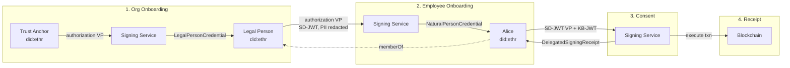
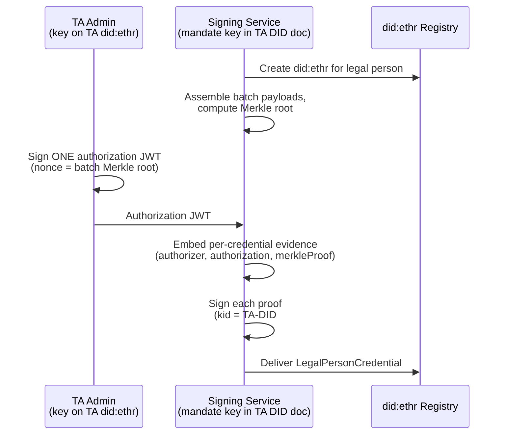
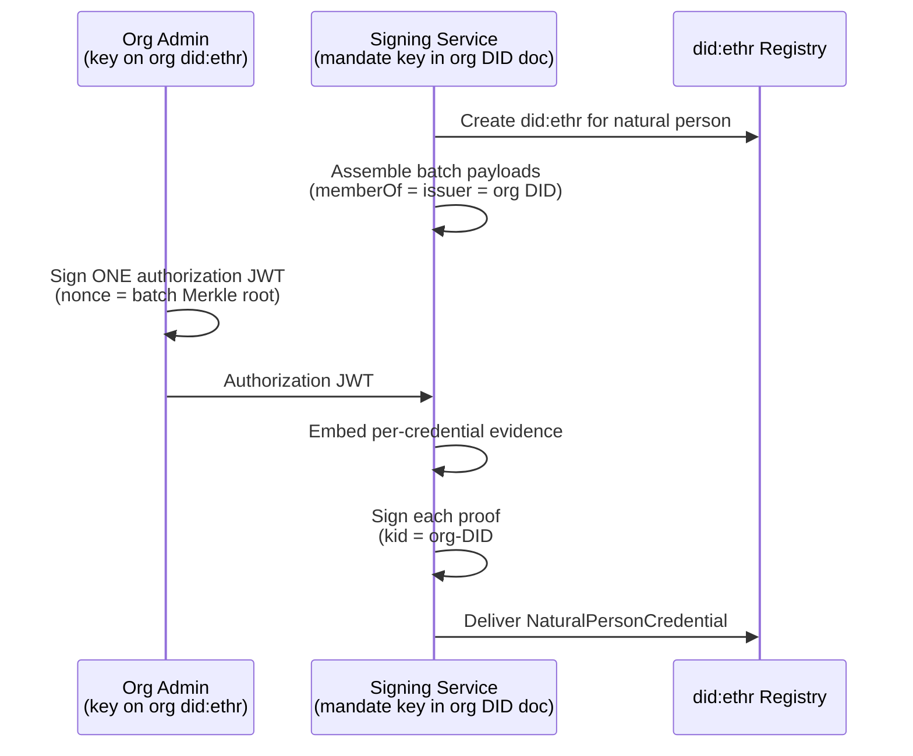
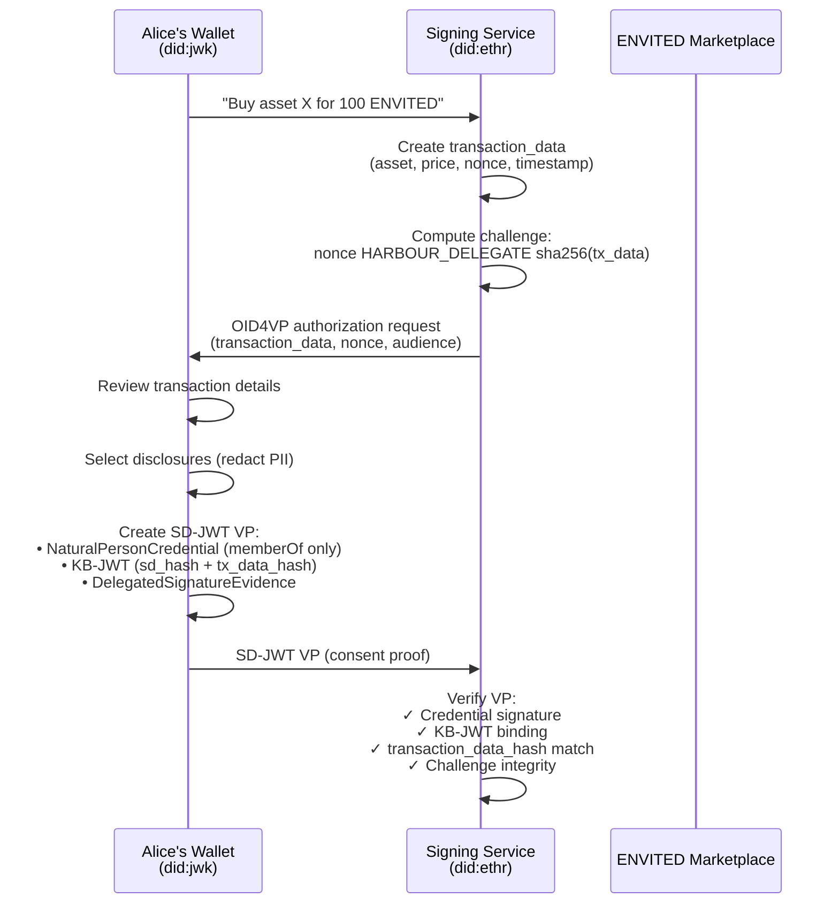
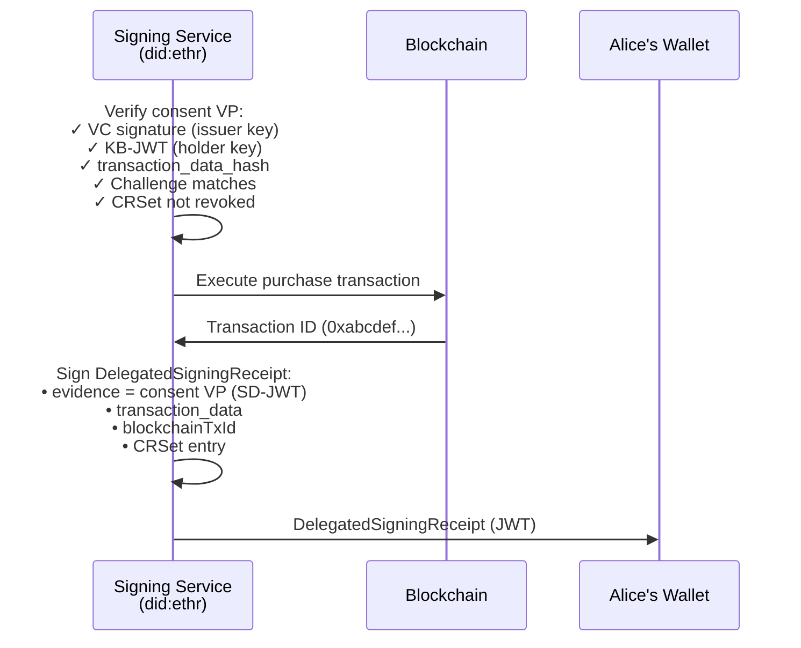

# Harbour Credentials — Example User Journey

This folder contains a complete, end-to-end example of the Harbour credential
lifecycle: from organization onboarding through employee credentialing to a
delegated blockchain transaction with privacy-preserving audit.

## Overview


```mermaid
flowchart LR
    subgraph "1. Org Onboarding"
        TA[Trust Anchor<br/>did:ethr] -->|authorization VP| SS1[Signing Service]
        SS1 -->|LegalPersonCredential| LP[Legal Person<br/>did:ethr]
    end
    subgraph "2. Employee Onboarding"
        LP -->|authorization VP<br/>SD-JWT, PII redacted| SS2[Signing Service]
        SS2 -->|NaturalPersonCredential| NP[Alice<br/>did:ethr]
        NP -.->|memberOf| LP
    end
    subgraph "3. Consent"
        NP -->|SD-JWT VP + KB-JWT| SS3[Signing Service]
    end
    subgraph "4. Receipt"
        SS3 -->|execute txn| BC[Blockchain]
        SS3 -->|DelegatedSigningReceipt| NP
    end
```

## Representation: these examples vs the issued `dc+sd-jwt` credentials

> **The `*.json` files here are human-readable, logically-equivalent views of the
> credentials — not the credentials themselves.** Every Harbour credential is
> ultimately issued as a **`dc+sd-jwt`** SD-JWT VC (a signed, compact, selectively
> disclosable token). These expanded JSON-LD files exist for two reasons: they are
> readable by people, and they are the form validated against the ontology's SHACL
> shapes (`make validate shacl` runs over `examples/*.json` + `examples/gaiax/*.json`).
> A `dc+sd-jwt` payload cannot be the SHACL target — it carries `_sd` digest arrays
> instead of claims, so it is not valid credential JSON-LD.

Each example is therefore the **fully-disclosed logical content** of a credential.
The real wire credential (and its readable unpacked form) is produced by the story
pipeline into `signed/<name>.sd-jwt` and `signed/<name>.decoded.json`. The following
fields are intentionally **absent** from the expanded JSON-LD and added at issuance:

| Omitted here | Why | Where it appears |
|---|---|---|
| Issuer signature / JOSE envelope | The JSON-LD is unsigned logical content; the wire form is an issuer-signed compact JWS. | `signed/<name>.sd-jwt` |
| `_sd` / `_sd_alg` digests + salted disclosures | The JSON-LD shows every `credentialSubject` claim in cleartext; in the real VC those claims are selectively disclosable and stored as salted digests until disclosed. | the SD-JWT and its `~`-separated disclosures |
| `vct` (SD-JWT VC type) | Derived at issuance from the credential's harbour `type` (via the LinkML `vct:` annotations). | issuer-signed payload |
| `cnf` (holder key binding) | Added at issuance from the subject's key; enables KB-JWT presentation. | issuer-signed payload |
| KB-JWT | Created by the **holder** when presenting, not at issuance. | a presentation, not the issued VC |
| Evidence `authorization` (wallet KB-JWT), `authorizationMessage`, and `merkleProof` | Generated by the pipeline at batch-signing time — they depend on the batch's Merkle root and the admin wallet key, so they are not authored by hand. The source evidence carries only `authorizedBy`. | `signed/<name>.decoded.json` |

The `signed/<name>.decoded.json` companion is the faithful, readable view of the
**actual** issued credential: disclosures resolved, evidence carrying the real
authorization KB-JWT, signed message, and Merkle inclusion proof. See
[`docs/specs/batched-credential-evidence.md`](../docs/specs/batched-credential-evidence.md)
for the evidence and revocation model.

## Core Credentials vs Gaia-X Domain

The examples use a **two-tier layout**:

- **Root (`examples/`)**: Core harbour credential skeletons that demonstrate the
  envelope structure (evidence VP nesting, CRSet status) without domain-specific data.
  Currently: `credential-with-evidence.json`.

- **`gaiax/`**: [Gaia-X domain credentials](gaiax/README.md) — the complete
  end-to-end user journey. These credentials carry Gaia-X properties
  (registration number, addresses) and reference the
  `https://w3id.org/gaia-x/development#` context.

Credential types in the Gaia-X layer use the `harbour.gx:` namespace prefix
(e.g. `harbour.gx:LegalPersonCredential`, `harbour.gx:NaturalPerson`) while core
types use `harbour:` (e.g. `harbour:CRSetEntry`, `harbour:BatchCredentialEvidence`).

## Credential Issuance Model

Issuers are **sovereign** ([ADR-006](../docs/decisions/006-sovereign-issuers.md)):
a credential's `issuer` is the vouching party's own `did:ethr`, and the
**Signing Service executes every proof under a mandate** — its key is listed
as an assertion-only `#delegate-1` verification method in the issuer's DID
document, and the proof `kid` names that method. Every credential carries two
distinct signatures:

- **Evidence** (`harbour:BatchCredentialEvidence`) — the authorization,
  signed by a *human admin* whose key is authorized on the issuing org's
  `did:ethr`. One admin signature covers a whole batch via a Merkle root
  (see [`batched-credential-evidence.md`](../docs/specs/batched-credential-evidence.md)).
- **Proof** (the SD-JWT signature) — produced by the Signing Service via the
  issuer's mandate key. It makes the credential verifiable; it decides nothing.

Who issues what:

- **LegalPersonCredential**: issued by the **Trust Anchor** (`issuer` = TA
  DID); a Trust Anchor admin signs the batch evidence.
- **NaturalPersonCredential**: issued by the **organization** (`issuer` = org
  DID, and `memberOf` MUST equal `issuer`); an org admin signs the batch
  evidence.

### Trust Anchor Credential

The Trust Anchor holds a **normal LegalPersonCredential** where
`issuer == credentialSubject.id` (analogous to a root CA certificate): it is
authorized and proof-signed exactly like any other LegalPersonCredential, and
trust in it comes from out-of-band knowledge of the Trust Anchor's DID. It is
publicly resolvable via a `LinkedCredentialService` endpoint in the Trust
Anchor's DID document. Its Gaia-X compliance references resolve to the Trust
Anchor's own input trio (`gx-trust-anchor-*.json`). See
[`gaiax/trust-anchor-credential.json`](gaiax/trust-anchor-credential.json).

## Actors and Identities

Every actor has a `did:ethr` identity anchored on Base. Users also have a
`did:jwk` wallet key (P-256) in the Altme wallet. When a user requests a
credential, the authorizing party presents a VP to the Signing Service. Harbour
then creates the `did:ethr` identifier and exposes **the same P-256 public
key** from the wallet as the local `#controller` verification method in the
resolved DID document.

| Actor | Role | Identity (`did:ethr`) | DID Document |
|-------|------|-----------------------|--------------|
| **Harbour Trust Anchor** | Root of trust, authorizes orgs | `did:ethr:0x14a34:0x4d6246a7d1e60caa44b75e3af9b37ac8d6442774` | [`harbour-trust-anchor.did.json`](did-ethr/harbour-trust-anchor.did.json) |
| **Harbour Signing Service** | Executes all proofs via per-issuer mandate keys (ADR-006); signs delegated txns (`#delegate-1`) | `did:ethr:0x14a34:0x31f1ca3dc5da9f83f360d805662d11a418950202` | [`harbour-signing-service.did.json`](did-ethr/harbour-signing-service.did.json) |
| **Example Corporation GmbH** | Legal person (organization); issues its employees' credentials | `did:ethr:0x14a34:0xa682b9044de0a1ad3429e8c6a0be0ed45d01da93` | [`legal-person-0aa6d7ea-...did.json`](did-ethr/legal-person-0aa6d7ea-27ef-416f-abf8-9cb634884e66.did.json) |
| **Alice Smith** | Natural person (employee) | `did:ethr:0x14a34:0x272c04206c826047add586cbf7f4ffc4386da129` | [`natural-person-550e8400-...did.json`](did-ethr/natural-person-550e8400-e29b-41d4-a716-446655440000.did.json) |
| **ENVITED Marketplace** | Data marketplace (external) | `did:ethr:0x14a34:0x89fe5e7f506d992f76bcba309773c0ee3ee6039c` | — |

> **Privacy note**: All `did:ethr` identifiers use opaque chain/address segments — never
> real names or organization names. This prevents DID IRIs from leaking identity
> information at the public layer.

### Signing Service Key Roles

The Signing Service DID document contains two P-256 verification methods:

| Key | Relationship | Purpose |
|-----|-------------|---------|
| `#controller` | `authentication`, `assertionMethod` | Primary controller key; signs the Signing Service's own artifacts (e.g. delegated-signing receipts) |
| `#delegate-1` | `authentication`, `capabilityDelegation` | Delegated transaction signing |

**The mandate (ADR-006):** the same Signing Service public key also appears as
an **assertion-only `#delegate-1`** verification method in each sovereign
issuer's DID document (Trust Anchor, organizations). Credential proofs carry a
`kid` naming that method in the *issuer's* document — never the Signing
Service's own DID — so any issuer can revoke the mandate unilaterally by
editing its DID document.

Signer DID documents in these Harbour examples expose local P-256 controller
keys directly. They do not model a separate synthetic secp256k1 recovery method
in the example JSON output.

---

## Step 1: Organization Onboarding — LegalPersonCredential

The **Trust Anchor issues** the organization's `LegalPersonCredential`
(`issuer` = Trust Anchor DID). A Trust Anchor **admin** signs one batch
authorization JWT over the Merkle root of all LegalPersonCredentials issued in
the batch (including the Trust Anchor's own); the **Signing Service** then
executes each proof with the assertion-only `#delegate-1` mandate key in the
Trust Anchor's DID document.


```mermaid
sequenceDiagram
    participant ADM as TA Admin<br/>(key on TA did:ethr)
    participant SS as Signing Service<br/>(mandate key in TA DID doc)
    participant DW as did:ethr Registry

    SS->>DW: Create did:ethr for legal person
    SS->>SS: Assemble batch payloads,<br/>compute Merkle root
    ADM->>ADM: Sign ONE authorization JWT<br/>(nonce = batch Merkle root)
    ADM->>SS: Authorization JWT
    SS->>SS: Embed per-credential evidence<br/>(authorizer, authorization, merkleProof)
    SS->>SS: Sign each proof<br/>(kid = TA-DID#delegate-1)
    SS->>DW: Deliver LegalPersonCredential
```

**What the evidence proves**: a human Trust Anchor admin authorized exactly
this credential's payload (its Merkle leaf folds to the signed root). The
Signing Service cannot fabricate an authorization — it cannot forge the
admin's signature.

### Example files

| File | Description |
|------|-------------|
| [`gaiax/trust-anchor-credential.json`](gaiax/trust-anchor-credential.json) | Trust Anchor's own LegalPersonCredential (root of trust, `issuer == subject`) |
| [`gaiax/legal-person-credential.json`](gaiax/legal-person-credential.json) | Unsigned credential (expanded JSON-LD) |
| `gaiax/signed/legal-person-credential.sd-jwt` | Signed credential (dc+sd-jwt wire format, gitignored) |
| `gaiax/signed/legal-person-credential.decoded.json` | Decoded SD-JWT (header + payload + disclosures, gitignored) |
| [`did-ethr/legal-person-0aa6d7ea-...did.json`](did-ethr/legal-person-0aa6d7ea-27ef-416f-abf8-9cb634884e66.did.json) | Legal person DID document (incl. Signing Service mandate key) |

### Code

```python
# Python — issue with batched evidence (as the story pipeline does)
from harbour.sd_jwt import build_sd_jwt_payload, sign_sd_jwt
from harbour.batch_evidence import build_batch_evidence

payload, disclosures = build_sd_jwt_payload(credential, vct=vct)
evidence = build_batch_evidence([payload], admin_wallet_key, authorized_by=ta_did, audience=gatehouse_did_key)
payload["evidence"] = [evidence[0]]
sd_jwt = sign_sd_jwt(payload, disclosures, ss_key, kid=f"{ta_did}#delegate-1")
```

```typescript
// TypeScript — issue with batched evidence
import { buildSdJwtPayload, signSdJwt, buildBatchEvidence } from '@reachhaven/harbour-credentials';

const { payload, disclosures } = buildSdJwtPayload(credential, { vct });
const evidence = await buildBatchEvidence([payload], adminWalletKey, { authorizedBy: taDid, audience: gatehouseDidKey });
payload.evidence = [evidence[0]];
const sdJwt = await signSdJwt(payload, disclosures, ssKey, { kid: `${taDid}#delegate-1` });
```

---

## Step 2: Employee Onboarding — NaturalPersonCredential

The **organization issues** its employee's `NaturalPersonCredential`
(`issuer` = org DID, and `memberOf` MUST equal `issuer`). An **org admin**
signs one batch authorization JWT over the Merkle root — one signature covers
all employees onboarded in the batch — and the **Signing Service** executes
each proof with the mandate key in the organization's DID document.


```mermaid
sequenceDiagram
    participant ADM as Org Admin<br/>(key on org did:ethr)
    participant SS as Signing Service<br/>(mandate key in org DID doc)
    participant DW as did:ethr Registry

    SS->>DW: Create did:ethr for natural person
    SS->>SS: Assemble batch payloads<br/>(memberOf = issuer = org DID)
    ADM->>ADM: Sign ONE authorization JWT<br/>(nonce = batch Merkle root)
    ADM->>SS: Authorization JWT
    SS->>SS: Embed per-credential evidence
    SS->>SS: Sign each proof<br/>(kid = org-DID#delegate-1)
    SS->>DW: Deliver NaturalPersonCredential
```

**Chain of trust**: The Trust Anchor issued the org's LegalPersonCredential
(Step 1); the org issues its employees' credentials (Step 2); the Signing
Service only executes proofs under each issuer's revocable mandate. The
`memberOf` field references the legal person's opaque `did:ethr` identifier
(UUID-based, no company name) and must equal the credential's `issuer`. A
verifier resolves the org DID and its **published LegalPersonCredential**
(`LinkedCredentialService`) to confirm organizational affiliation without the
credential itself leaking PII.

> **Discussion point**: `memberOf` is currently selectively disclosable. Whether
> it should be always-disclosed (to guarantee the trust chain) or remain
> optional (for maximum privacy) is an open design decision.

### Example files

| File | Description |
|------|-------------|
| [`gaiax/natural-person-credential.json`](gaiax/natural-person-credential.json) | Unsigned credential (expanded JSON-LD) |
| `gaiax/signed/natural-person-credential.sd-jwt` | Signed credential (dc+sd-jwt wire format, gitignored) |
| `gaiax/signed/natural-person-credential.decoded.json` | Decoded SD-JWT (header + payload + disclosures, gitignored) |
| [`did-ethr/natural-person-550e8400-...did.json`](did-ethr/natural-person-550e8400-e29b-41d4-a716-446655440000.did.json) | Alice's DID document |

### Code

```python
# Python — issue SD-JWT-VC with structured selective disclosure (RFC 9901 §6.2)
from harbour.sd_jwt import issue_sd_jwt_vc

sd_jwt = issue_sd_jwt_vc(
    credential,
    private_key,
    vct="https://w3id.org/reachhaven/harbour/gx/v1/NaturalPersonCredential",
    disclosable=["credentialSubject.givenName", "credentialSubject.familyName",
                 "credentialSubject.email", "credentialSubject.memberOf"],
)
# Nested structure preserved — sensitive values hidden behind _sd digests
```

---

## Step 3: Delegated Transaction — Consent VP

Alice wants to buy a data asset on the ENVITED marketplace. Instead of signing the
blockchain transaction directly, she delegates it to the Harbour Signing Service.

The signing service creates an OID4VP `transaction_data` object describing the
purchase. Alice's wallet creates an **SD-JWT VP** with:

- Her `NaturalPersonCredential` (PII redacted — only `memberOf` disclosed)
- A **KB-JWT** binding her signature to the `transaction_data` hash
- `DelegatedSignatureEvidence` with the challenge string


```mermaid
sequenceDiagram
    participant A as Alice's Wallet<br/>(did:jwk)
    participant SS as Signing Service<br/>(did:ethr)
    participant MP as ENVITED Marketplace

    A->>SS: "Buy asset X for 100 ENVITED"
    SS->>SS: Create transaction_data<br/>(asset, price, nonce, timestamp)
    SS->>SS: Compute challenge:<br/>nonce HARBOUR_DELEGATE sha256(tx_data)
    SS->>A: OID4VP authorization request<br/>(transaction_data, nonce, audience)
    A->>A: Review transaction details
    A->>A: Select disclosures (redact PII)
    A->>A: Create SD-JWT VP:<br/>• NaturalPersonCredential (memberOf only)<br/>• KB-JWT (sd_hash + tx_data_hash)<br/>• DelegatedSignatureEvidence
    A->>SS: SD-JWT VP (consent proof)
    SS->>SS: Verify VP:<br/>✓ Credential signature<br/>✓ KB-JWT binding<br/>✓ transaction_data_hash match<br/>✓ Challenge integrity
```

**What Alice discloses** (selective disclosure):

| Claim | Disclosed? | Why |
|-------|-----------|-----|
| `memberOf` | Yes | Trust chain — proves organizational affiliation |
| `name` | Yes | Non-PII display name |
| `givenName` | No | PII — redacted |
| `familyName` | No | PII — redacted |
| `email` | No | PII — redacted |

### Wire format

On the wire, the consent VP is an SD-JWT compact serialization:
`<vp-jwt>~<disclosure1>~...~<kb-jwt>`

The consent VP is not persisted as a standalone example — it is an ephemeral
artifact between Alice's wallet and the Signing Service. The receipt credential
([`gaiax/delegated-signing-receipt.json`](gaiax/delegated-signing-receipt.json)) embeds the
consent VP as evidence, making it the durable audit record.

### Code

```python
# Python — create delegation challenge
from harbour.delegation import TransactionData, create_delegation_challenge

tx = TransactionData.create(
    action="data.purchase",
    txn={
        "asset_id": "urn:uuid:550e8400-e29b-41d4-a716-446655440000",
        "price": "100",
        "currency": "ENVITED",
        "marketplace": "did:ethr:0x14a34:0x89fe5e7f506d992f76bcba309773c0ee3ee6039c",
    },
    credential_ids=["harbour_natural_person"],
)
challenge = create_delegation_challenge(tx)
# "da9b1009 HARBOUR_DELEGATE cb991694..."
```

```python
# Python — create consent VP with selective disclosure
from harbour.sd_jwt_vp import issue_sd_jwt_vp

sd_jwt_vp = issue_sd_jwt_vp(
    alice_sd_jwt_vc,
    alice_private_key,
    disclosures=["memberOf"],       # only disclose non-PII
    evidence=[{
        "type": "DelegatedSignatureEvidence",
        "transaction_data": tx.to_dict(),
        "delegatedTo": "did:ethr:0x14a34:0x31f1ca3dc5da9f83f360d805662d11a418950202",
    }],
    nonce=tx.nonce,
    audience="did:ethr:0x14a34:0x31f1ca3dc5da9f83f360d805662d11a418950202",
)
```

```typescript
// TypeScript equivalents
import {
  createTransactionData, createDelegationChallenge,
  issueSdJwtVp,
} from '@reachhaven/harbour-credentials';
```

---

## Step 4: Transaction Execution — DelegatedSigningReceipt

The signing service verifies Alice's consent VP, executes the blockchain purchase,
and issues a **receipt credential** (`DelegatedSigningReceipt`) with the consent
proof embedded as evidence.


```mermaid
sequenceDiagram
    participant SS as Signing Service<br/>(did:ethr)
    participant BC as Blockchain
    participant A as Alice's Wallet

    SS->>SS: Verify consent VP:<br/>✓ VC signature (issuer key)<br/>✓ KB-JWT (holder key)<br/>✓ transaction_data_hash<br/>✓ Challenge matches<br/>✓ CRSet not revoked
    SS->>BC: Execute purchase transaction
    BC->>SS: Transaction ID (0xabcdef...)
    SS->>SS: Sign DelegatedSigningReceipt:<br/>• evidence = consent VP (SD-JWT)<br/>• transaction_data<br/>• blockchainTxId<br/>• CRSet entry
    SS->>A: DelegatedSigningReceipt (JWT)
```

### Three-Layer Privacy Model

The receipt credential is an **SD-JWT-VC**. Different audiences see different
layers of information:

| Layer | Audience | What's Visible |
|-------|----------|----------------|
| **Layer 1 — Public** | Everyone | CRSet entry (credential exists), `transactionHash` on-chain, DID identifiers (opaque UUIDs), KB-JWT signature valid |
| **Layer 2 — Authorized** | Auditor | Transaction details (asset, price, marketplace), consent VP hash verification, `memberOf` (organization DID) |
| **Layer 3 — Full Audit** | Compliance | User identity (name, email, organization name), full credential chain |

### Example files

| File | Description |
|------|-------------|
| [`gaiax/delegated-signing-receipt.json`](gaiax/delegated-signing-receipt.json) | Unsigned receipt (expanded JSON-LD) |
| `gaiax/signed/delegated-signing-receipt.sd-jwt` | Signed receipt (dc+sd-jwt wire format, gitignored) |
| `gaiax/signed/delegated-signing-receipt.decoded.json` | Decoded SD-JWT (header + payload + disclosures, gitignored) |

### Code

```python
# Python — verify consent VP
from harbour.sd_jwt_vp import verify_sd_jwt_vp

result = verify_sd_jwt_vp(
    sd_jwt_vp,
    issuer_public_key,
    holder_public_key,
    expected_nonce="da9b1009",
    expected_audience="did:ethr:0x14a34:0x31f1ca3dc5da9f83f360d805662d11a418950202",
)

# Python — sign receipt credential
from harbour.signer import sign_vc_jose
receipt_jwt = sign_vc_jose(receipt, service_private_key, kid=service_kid)
```

```typescript
// TypeScript equivalents
import { verifySdJwtVp, signJwt } from '@reachhaven/harbour-credentials';
```

---

## File Index

### Core skeletons (unsigned, expanded JSON-LD)

| File | Description |
|------|-------------|
| [`credential-with-evidence.json`](credential-with-evidence.json) | Generic VC with batched credential evidence |

### Gaia-X domain storyline (`gaiax/`)

| File | Step | Description |
|------|------|-------------|
| [`gaiax/trust-anchor-credential.json`](gaiax/trust-anchor-credential.json) | — | Trust Anchor self-signed credential (root of trust) |
| [`gaiax/legal-person-credential.json`](gaiax/legal-person-credential.json) | 1 | Organization credential |
| [`gaiax/natural-person-credential.json`](gaiax/natural-person-credential.json) | 2 | Employee credential with `memberOf` link |
| [`gaiax/delegated-signing-receipt.json`](gaiax/delegated-signing-receipt.json) | 3+4 | Transaction receipt with embedded consent VP as evidence |

### Signed artifacts (`signed/`)

For each credential, the signer produces:

| Suffix | Content |
|--------|---------|
| `.sd-jwt` | Signed dc+sd-jwt compact credential (wire format) |
| `.decoded.json` | Human-readable decoded header + payload (with `_sd` digests and full batch evidence) + decoded disclosures |

### DID documents (`did-ethr/`)

| File | Actor | Method |
|------|-------|--------|
| [`harbour-trust-anchor.did.json`](did-ethr/harbour-trust-anchor.did.json) | Harbour Trust Anchor | `did:ethr` |
| [`harbour-signing-service.did.json`](did-ethr/harbour-signing-service.did.json) | Harbour Signing Service | `did:ethr` |
| [`legal-person-0aa6d7ea-...did.json`](did-ethr/legal-person-0aa6d7ea-27ef-416f-abf8-9cb634884e66.did.json) | Example Corporation GmbH | `did:ethr` |
| [`natural-person-550e8400-...did.json`](did-ethr/natural-person-550e8400-e29b-41d4-a716-446655440000.did.json) | Alice Smith | `did:ethr` |

## Regenerating Signed Examples

```bash
source .venv/bin/activate
PYTHONPATH=src/python:$PYTHONPATH python -m credentials.example_signer examples/
```

This signs all `examples/*.json` and `examples/gaiax/*.json` files, writing
artifacts to `examples/signed/` and `examples/gaiax/signed/` respectively.

> **Wire format vs JSON-LD**: The `.json` files in this directory show credentials
> as expanded JSON-LD for readability. On the wire, every credential is a
> `dc+sd-jwt` SD-JWT-VC signed with ES256 (P-256). The `.sd-jwt` files contain
> the actual wire format; `.decoded.json` files show the decoded issuer JWT
> and disclosures.

## Related Documentation

- [Evidence types](../docs/guide/evidence.md) — BatchCredentialEvidence + DelegatedSignatureEvidence
- [Delegated signing flow](../docs/guide/delegated-signing.md) — Complete OID4VP consent flow
- [Delegation challenge spec](../docs/specs/delegation-challenge-encoding.md) — Challenge format + transaction data
- [DID documents](did-ethr/README.md) — All example `did:ethr` identifiers
